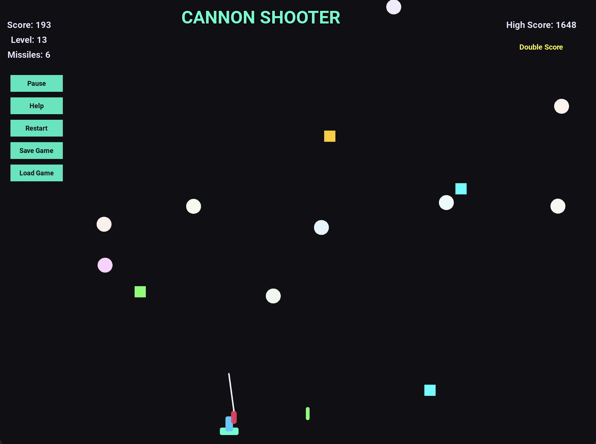

# Cannon
on Shooter Game
A modern 2D shooting game built with Python and Kivy framework. Defend your position by shooting incoming balls with your cannon, collect power-ups, and achieve the highest score!

## Features

- 🎯 Precise cannon control with mouse/keyboard
- 🔫 Dual weapon system (Bullets & Missiles)
- ⚡ Power-ups: Speed Boost, Shield, Double Score
- 🏆 Score system with combo multipliers
- 📈 Progressive difficulty with level system
- 💾 Save/Load game state
- 🎮 Comprehensive in-game help system
- 🎨 Modern neon-themed graphics
- 🎵 Immersive sound effects

## Run the game:

```bash
python main.py
```

## Requirements

- Python 3.7+
- Kivy 2.0+
- Sound files (included in repository)

## How to Play

### Controls

| Control          | Action                        |
|------------------|-------------------------------|
| Mouse Movement   | Aim cannon                    |
### see the Help for More

### Gameplay

- Shoot incoming balls before they reach the bottom
- Earn points for each successful hit
- Build combos by hitting consecutive shots
- Collect power-ups for special abilities:
  - **Speed Boost**: Doubles bullet speed
  - **Shield**: Protects against one missed ball
  - **Double Score**: Doubles all points earned
- Earn missiles every 10 destroyed balls
- Progress through levels by scoring points

### Scoring System

| Action                     | Points  |
|----------------------------|---------|
| Regular Hit                | 1 point |
| Missile Hit                | 3 points|
| Combo Multiplier (max 10x) | ×1-10   |
| Double Score Power-up      | ×2      |

## Development

### File Structure

```
canon-shooter/
├── main.py          # Main game logic
├── canon.kv         # Kivy layout file
├── README.md        # This file
└── sounds/          # Sound effects
    ├── bullet.wav
    ├── gameOver.wav
    ├── missile.wav
    └── pop.wav
```

### Requirements

- Python 3.7+
- Kivy 2.0+

Install dependencies:
```bash
pip install kivy
```

## License

This project is licensed under the MIT License

## Screenshots



## Acknowledgments

- Kivy Framework
- Python Community
- Open source game development resources
