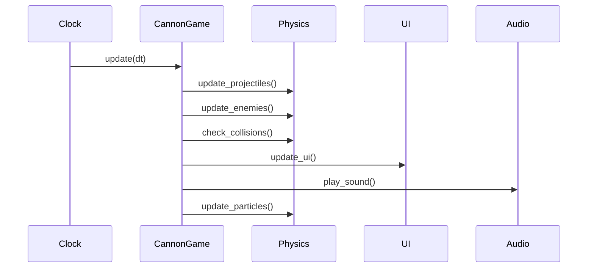
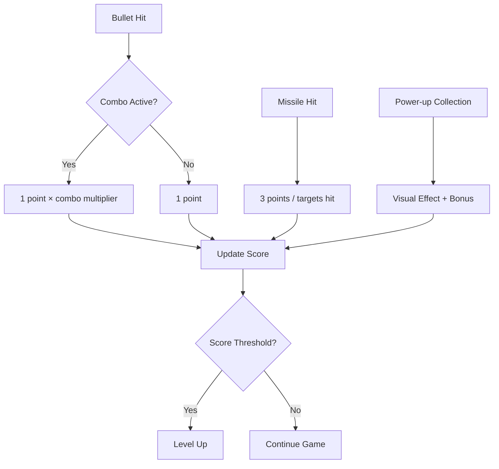
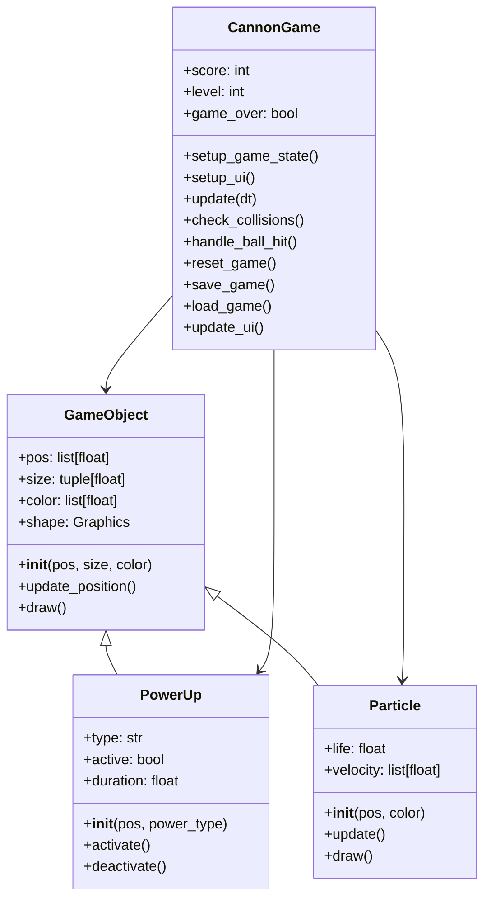
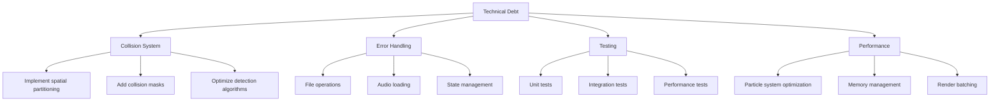

# Cannon Game Technical Report

## Overview
Cannon Game is a 2D arcade-style shooting game built using Python and the Kivy framework. Players control a cannon to shoot incoming balls while collecting power-ups and managing limited missile resources.

## Key Features
- **Dual Weapon System**: Bullets (unlimited) and Missiles (limited)
- **Power-ups**: Speed Boost, Shield, Double Score
- **Progressive Difficulty**: Increasing speed and complexity with each level
- **Combo System**: Bonus points for consecutive hits
- **Save/Load System**: Persist game state between sessions
- **Modern UI**: Neon-themed interface with dynamic elements

## Technical Architecture

### Core Components
1. **GameObject**: Base class for all game entities with position, size, and visual representation
2. **CannonGame**: Main game widget handling game logic, UI, and state management
3. **PowerUp**: Special abilities with timed effects and visual indicators
4. **Particle**: Visual effects for explosions and impacts with life cycle management

### Game Loop
The game uses Kivy's Clock scheduler to update game state at 60 FPS. The update cycle includes:



Key update methods:
- `update()`: Main game loop coordinating all subsystems
- `update_projectiles()`: Handles bullet/missile movement with gravity effects
- `update_enemies()`: Manages ball movement with sinusoidal patterns and spawning logic
- `check_collisions()`: Detects and handles object interactions using bounding box detection
- `update_particles()`: Manages particle lifecycles and visual effects

## Game Mechanics

### Scoring System


- **Regular Hit**: 1 point × combo multiplier (capped at 10x)
- **Missile Hit**: 3 points (divided among targets with minimum 1 point each)
- **Combo System**: 
  - 2 second timer between hits
  - Visual indicator in score display
  - Resets on miss or timeout
- **Level Progression**: 
  - Every 15 points increases level
  - Level affects spawn rate, speed, and movement complexity

### Power-ups
| Type         | Effect                     | Duration Formula          | Visual Indicator         |
|--------------|----------------------------|---------------------------|--------------------------|
| Speed Boost  | 2x bullet speed            | 10s × log2(level)         | Green trail effect       |
| Shield       | Blocks one missed ball     | 15s × log2(level)         | Cyan force field         |
| Double Score | 2x points                  | 20s × log2(level)         | Golden score numbers     |

Power-up Implementation Details:
- Spawn probability: 1% per frame
- Collection triggers particle explosion
- Visual indicators fade with remaining time
- Stackable effects (multiple power-ups can be active)

### Enemy Behavior
```python
def spawn_enemies():
    # Initial values
    initial_balls = 5
    initial_speed = 0.3
    
    # Diminishing returns formula
    max_balls = initial_balls + (level * 1.0) / (1 + level * 0.1)
    spawn_chance = 0.01 + (level * 0.002)
    
    # Movement patterns
    movement_intensity = 1 + (level * 0.1)
    ball.pos = (
        ball.pos[0] + math.sin(ball.pos[1] / 50) * 2 * movement_intensity,
        ball.pos[1] - base_speed
    )
```

Key Characteristics:
- **Spawn Rate**: Increases with level using diminishing returns formula
- **Movement Patterns**: 
  - Sinusoidal paths with increasing amplitude
  - Randomized starting positions
  - Level-dependent complexity
- **Speed Scaling**: 
  - Base speed + (level × 0.02) / (1 + level × 0.05)
  - Minimum and maximum speed caps

## Code Structure

### Main Classes


### Key Methods
- **Game Logic**:
  - `update(dt)`: Main game loop coordinating all subsystems
  - `check_collisions()`: Handles object interactions using bounding box detection
  - `handle_ball_hit()`: Processes scoring, combo system, and visual effects
  - `update_projectiles()`: Manages bullet/missile physics and trajectories
  - `update_enemies()`: Handles enemy spawning and movement patterns

- **UI Management**:
  - `setup_ui()`: Creates game interface with modern styling
  - `update_ui()`: Refreshes score, level, and status displays
  - `show_help()`: Displays interactive game instructions
  - `update_power_up_status()`: Shows active power-up effects

- **State Management**:
  - `save_game()`: Persists game state to JSON file
  - `load_game()`: Restores game state from JSON file
  - `reset_game()`: Initializes new game with proper state cleanup
  - `save_high_score()`: Updates persistent high score record

- **Audio System**:
  - `setup_game_objects()`: Loads and configures sound effects
  - `play_sound()`: Plays specified sound effect with volume control
  - Background music management with pause/resume functionality

### Physics Implementation
```python
# Projectile Movement
def update_projectiles(dt):
    # Bullet physics
    bullet.pos = (
        bullet.pos[0] + bullet_dx,
        bullet.pos[1] + bullet_dy
    )
    bullet_dy -= GRAVITY  # Apply gravity
    
    # Missile physics
    missile.pos = (
        missile.pos[0] + missile_dx,
        missile.pos[1] + missile_dy
    )
    missile_dy -= 0.1  # Reduced gravity effect
    
    # Boundary handling
    if missile.pos[0] < 0:
        missile.pos = (0, missile.pos[1])
        missile_dx = abs(missile_dx)  # Bounce right
    elif missile.pos[0] > Window.width:
        missile.pos = (Window.width, missile.pos[1])
        missile_dx = -abs(missile_dx)  # Bounce left
```

Key Physics Features:
- Gravity simulation for projectiles
- Bouncing mechanics for missiles
- Trajectory prediction system
- Collision detection with bounding boxes
- Particle system physics for explosions

## Development Environment

### Requirements
- Python 3.8+
- Kivy 2.0+
- Sound files (WAV format)
- JSON support for save/load functionality

### File Structure
```
Cannon Game/
├── main.py            # Main game logic and classes
├── cannon.kv          # Kivy language UI definition
├── report.md          # Technical documentation
├── high_score.json    # Persistent high score storage
├── save_game.json     # Game save state storage
├── bullet.wav         # Bullet firing sound
├── gameOver.wav       # Game over sound
├── missile.wav        # Missile firing sound
├── pop.wav            # Ball hit sound
```

### Audio System Implementation
```python
def setup_game_objects():
    self.sounds = {}
    sound_files = {
        'background': 'background.wav',
        'bullet': 'bullet.wav',
        'missile': 'missile.wav',
        'pop': 'pop.wav',
        'game_over': 'gameOver.wav'
    }
    
    for sound_name, file_name in sound_files.items():
        try:
            sound = SoundLoader.load(file_name)
            if sound:
                if sound_name == 'background':
                    sound.volume = 0.5
                    sound.loop = True
                self.sounds[sound_name] = sound
        except:
            print(f"Could not load {file_name}")
```

Audio Features:
- Sound effects for key game events
- Error handling for missing sound files
- Volume normalization

## Future Improvements

### Planned Features
1. **New Power-ups**:
   - Auto-aim: Automatically targets nearest ball
   - Rapid-fire: Increases fire rate temporarily
   - Time Slow: Slows down game speed
   - Homing Missiles: Guided projectiles
   - Shield Upgrade: Multiple hit protection

2. **Enhanced Graphics**:
   - Particle effects for all impacts
   - Animated power-up visuals
   - Background parallax scrolling
   - Dynamic lighting effects
   - Screen shake on explosions

3. **Game Modes**:
   - Timed Challenge: Score as many points as possible in limited time
   - Survival Mode: Infinite waves with increasing difficulty
   - Boss Battles: Special levels with unique enemies
   - Endless Mode: Continuous play with increasing difficulty
   - Challenge Mode: Specific objectives and constraints

4. **Multiplayer Support**:
   - Local co-op mode
   - Online leaderboards
   - Competitive mode
   - Team play options
   - Spectator mode

5. **Advanced Physics**:
   - Wind effects on projectiles
   - Bouncing projectiles
   - Destructible environments
   - Chain reactions

### Technical Debt


Key Areas for Improvement:
- **Collision System**:
  - Implement spatial partitioning (quadtree)
  - Add collision masks for precise detection
  - Optimize detection algorithms

- **Error Handling**:
  - Comprehensive file operation error handling
  - Graceful audio loading failures
  - Robust state management

- **Testing**:
  - Unit tests for core game logic
  - Integration tests for game systems
  - Performance tests for critical paths

- **Performance**:
  - Particle system optimization
  - Memory management improvements
  - Render batching for graphics
  - Background task optimization

## Conclusion
Cannon Game demonstrates effective use of Python and Kivy for 2D game development. The modular architecture and clear separation of concerns make the codebase maintainable and extensible. Future development will focus on enhancing gameplay features while maintaining performance and code quality.
